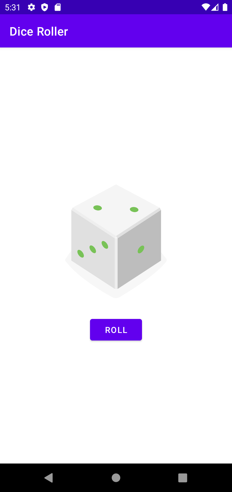

<h1 align="center">
  <a href="https://github.com/PitzTech/suno-movies">
	DiceRoller
  </a>
</h1>

<blockquote align="center">“Sucesso não é o resultado de um jogo, mas o destino de uma jornada”!</blockquote>

 

   

 

## 💻 Projeto

Um aplicativo de rolagem randômica de dados feito em Kotlin.

---

Projeto concluido com ♥ by PitzTech:wave:
 

  
  &nbsp;&nbsp;&nbsp;&nbsp;
  
  &nbsp;&nbsp;&nbsp;&nbsp;
  

